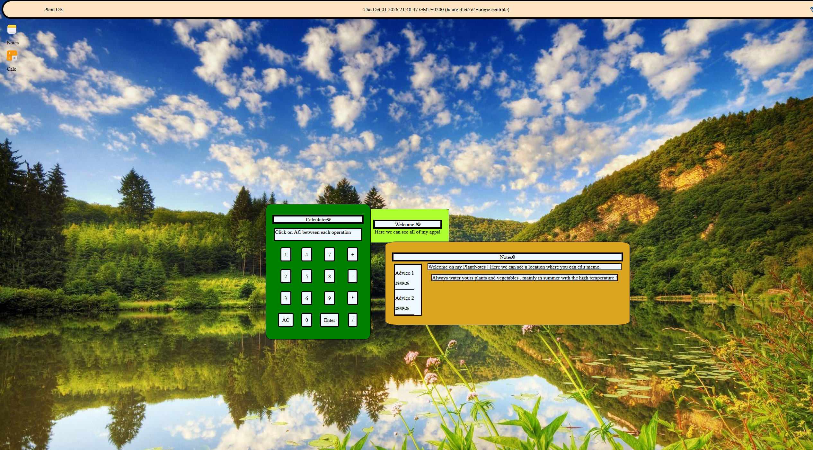
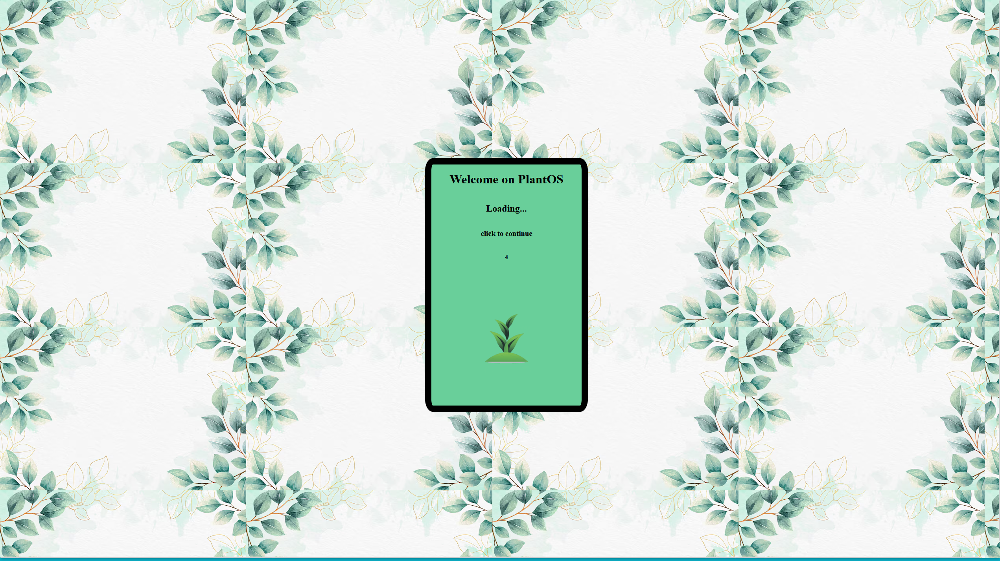
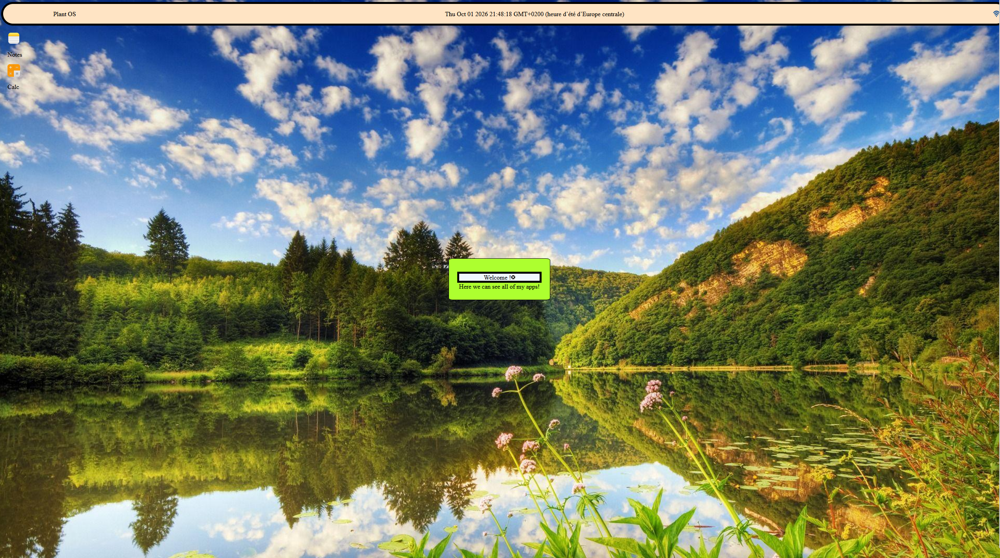

# Plant OS :

A tiny WebOS project made with HTML and JS

   
    <b>Test Me !</b>
  </a>

## About:
It's a little project of OS website made with hackclub tuto : https://jams.hackclub.com/batch/webOS

## Apps:
- A calculator
- A ToDo list
- A welcome windows 

## Features :
- A countdown and a Welcome page
- A calculator
- A Note app
- A fully functional time widget
- A beautiful Plant theme
- A system of draggable windows 

## Very Soon :
- A web browser
- A settings app to change the theme

## Photos :

